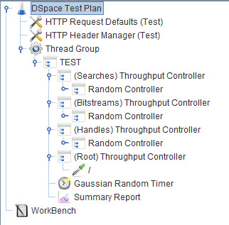
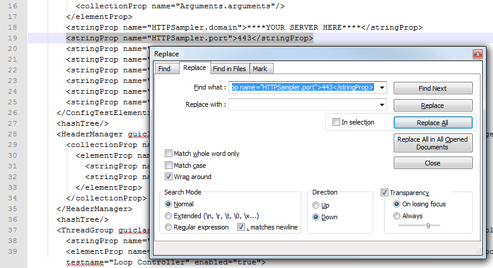
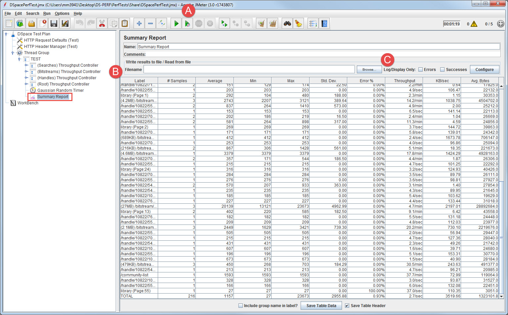

# JMeter DSpace Performance Test
## Prerequisites
- JMeter --- an open-source, Java-based load testing application created and maintained by Apache. Can be downloaded from the [Apache JMeter website](https://jmeter.apache.org/download_jmeter.cgi).
- Working knowledge of JMeter --- Apache provides fairly extensive documentation in their [User's Manual](https://jmeter.apache.org/usermanual/index.html). The first three chapters should provide a sufficient baseline knowledge to begin creating and running load tests. We edited our testing plans on a Windows desktop and used the included jmeterw.cmd's GUI.

## Georgetown's Approach
### Overview
The DSpacePerfTest.jmx file provides an example of the type of load testing we are currently running on our DSpace instances at Georgetown. Our approach was to create threads that would randomly access significant resources common to most user sessions (e.g. item pages, bitstreams, searches) and leave out low-impact and cached resources (e.g. css, javscript, etc.). After deciding what we considered to be significant types of activity, we did some grep'ing on our web logs to determine the approximate proportion of activity each type of resource accounted for and found the following:
- Root page (35%)
- Handles (31%)
- Bitstreams (29%)
- Searches (5%)

We configured the test to access random resources by the above proportions from small pools of each activity type. We then tested different combinations of thread counts and ramp-up times until we found the right balance to appropriately stress our servers and start gathering some metrics (both through the built-in JMeter listener elements as well as through external New Relic application monitoring). Since the sample test provided contains handles and bistreams unique to our environment, it isn't easily reconfigurable to other environments. It's main use to other institutions will be as a potential model for customized testing plan structures.

### Specifics
Below is an explanation of the important elements and configurations found in the example test, in the order in which they appear in the test plan:

- **HTTP Request Defaults (Test)** --- we grouped the common request settings in this element so that the test could easily be reconfigured for use on other servers, ports, etc.
- **HTTP Header Manger (Test)** --- an optional but helpful configuration in which we set the User-Agent header field so that the JMeter traffic could be easily distinguished in the web server logs.
- **Thread Group** --- this is where we adjusted the thread count, ramp-up period, and run-time options. The example test is set to run 5 concurrent threads, ramped up over 20 seconds, that loop continuously for five minutes. The thread count is purposefully low and will need to be progressively increased until your server is adequatelly stressed.
- **Throughput Controllers** --- the [Throughput Controllers](https://jmeter.apache.org/usermanual/component_reference.html#Throughput_Controller) are configured to execute one of their respective request types (search, bitstream, etc.) the frequency of time specified in the Overview section.
- **Random Controllers** --- each Throughput Controller (excepting the one for the root page) contains a [Random Controller](https://jmeter.apache.org/usermanual/component_reference.html#Random_Controller) that randomly selects one of the nested requests.
- **HTTP Request Samplers** --- these are the actual HTTP requests that are being executed during the load testing. We found it helpful to keep summary information in the request names (e.g. resource paths, bitstream sizes, search terms) so that the details of requests that had unexpected error rates or return times could be quickly understood without digging back into the test plan or actual DSpace site. We gathered about 20 requests for each type of resource using the [JMeter Test Script Recorder](https://jmeter.apache.org/usermanual/jmeter_proxy_step_by_step.pdf), but if you're looking to generate much larger pools of requests, the corresponding test plan XML could be generated programmatically.
- **Gaussian Random Timer** --- this element determines the amount of time JMeter waits between the consecutive requests. We've found a base of 500 milliseconds with a deviation of 100 milliseconds works pretty well for our purposes.
- **Summary Report** --- this element captures and summarizes the results of the test HTTP requests. JMeter has a number of different [Listeners](https://jmeter.apache.org/usermanual/component_reference.html#listeners) that can be used for capturing and displaying response data that could also be used.

### Customizing the Test
As we mentioned in the Specifics section, the example JMeter test provided would need to be tailored to the institution's deployment specifics. While the handles, bitstreams, searches, and other request-level settings can be manually entered, the quickest way to get up and running would probably be to utilize the [JMeter Test Script Recorder](https://jmeter.apache.org/usermanual/jmeter_proxy_step_by_step.pdf). When utilizing this tool, JMeter acts as a proxy for your browser and records your actions on your site as separate request elements, which can then be copied and modified to suit your testing plan. Just note that the recorder will capture all request information (including user-agent, server name, protocol) in each request element, which will override the top-level configurations in the HTTP Request Defaults element. This is fine if you expect these settings to stay static, but if you would like the option of changing the target server or using a custom user-agent in the header, an easy fix for this behavior is to open the test plan XML in your favorite text editor and run a couple of Find and Replace operations to replace these fields with empty strings.

You can then specify the settings globally in the top-level configuration elements (i.e. HTTP Request Defaults, etc.).

### Running & Results
Once your test is ready to run, you can launch it either via command-line or the GUI. Apache recommends running actual load tests using the [command-line interface](https://jmeter.apache.org/usermanual/get-started.html#non_gui). The documentation goes through all the available options, but the two most important are -t (to specify the test to run) and -l (to specify the file to save the sample results to, which can later be loaded into JMeter to review the performance of specific requests as well as overall trends). When launched via command line, JMeter will display status summaries in regular intervals until the test is complete.

We've run our load test a number of times from the GUI and so far haven't had any issues (results may be dependent on the specs of the client machine). When the test is launched via the GUI (A), results can be viewed in real-time (B). If a test was run via command-line, the results can be loaded into any of the listener elements by clicking the "Browse..." button and selecting the sample results file (C).

The sample test provided has one Summary Report element capturing data from all the sample requests, but additional listening elements can be placed on the sub-sections if data specific to one type of request is desired (e.g. only for bitstream downloads). In addition to the built-in JMeter result metrics, we've been using [NewRelic](https://newrelic.com/) to compare system and application performance under different conditions. The full NewRelic suite is not a free service, but basic free accounts with 24-hour data retention are also available.
